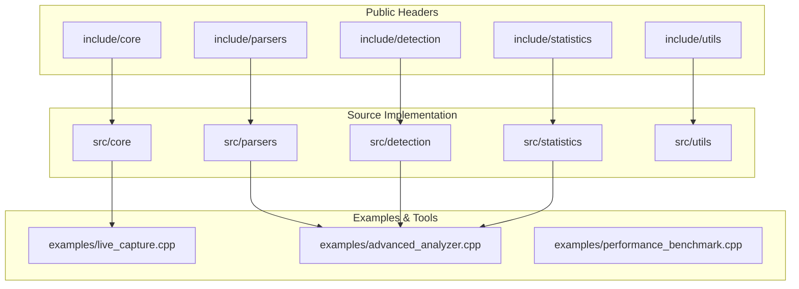
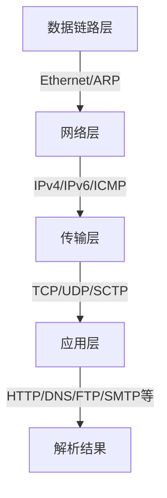
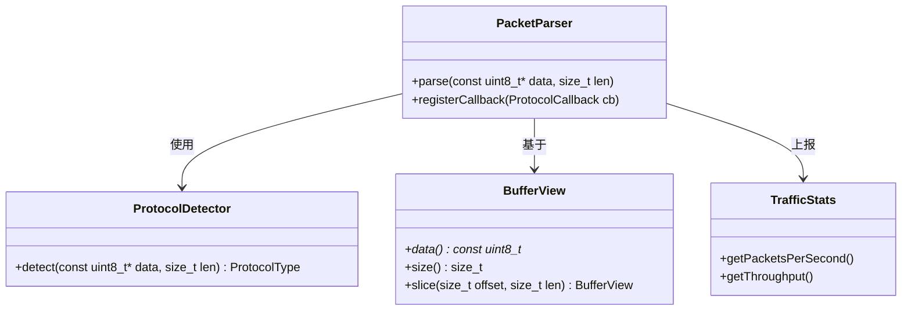
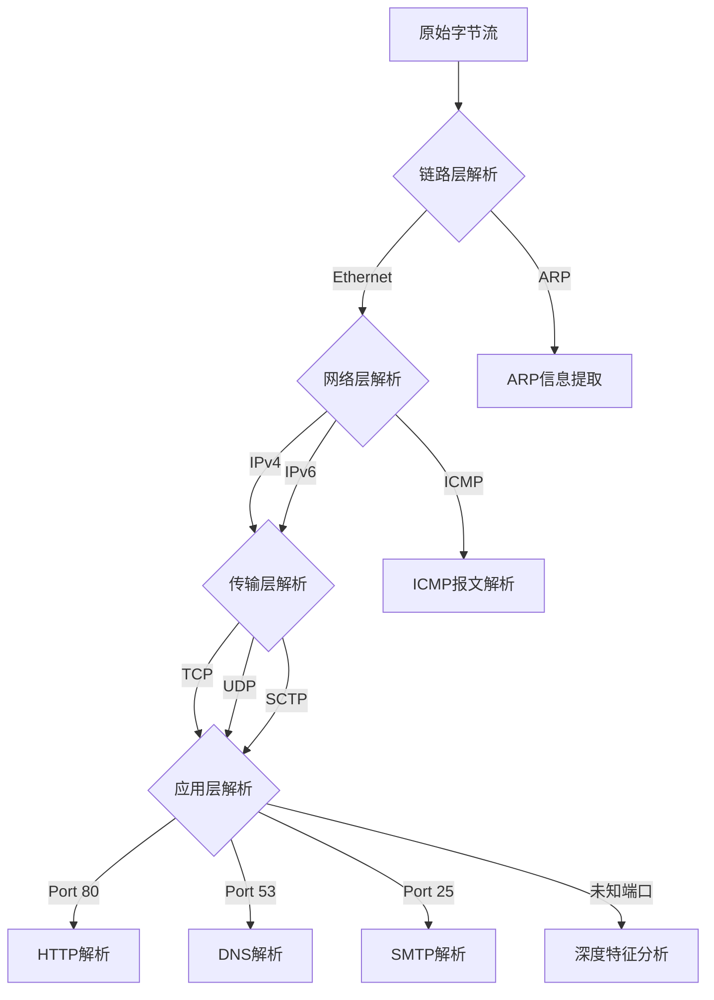

# 项目概述

<cite>
**本文档引用文件**  
- [org_design_doc.md](file://org_design_doc.md)
- [SOTA_IMPLEMENTATION_REPORT.md](file://SOTA_IMPLEMENTATION_REPORT.md)
- [README.md](file://README.md)
</cite>

## 目录
1. [引言](#引言)
2. [项目结构](#项目结构)
3. [核心设计目标](#核心设计目标)
4. [关键技术特性](#关键技术特性)
5. [系统架构理念](#系统架构理念)
6. [性能表现与基准分析](#性能表现与基准分析)
7. [协议解析层次体系](#协议解析层次体系)
8. [智能协议识别引擎](#智能协议识别引擎)
9. [与其他Npcap生态工具的集成](#与其他npcap生态工具的集成)
10. [演进方向与未来规划](#演进方向与未来规划)
11. [结论](#结论)

## 引言
protocol_praser 是一个专为现代高性能网络分析场景设计的协议解析库，旨在提供低延迟、高吞吐量的网络流量深度解析能力。该项目定位于成为Npcap生态系统中的核心解析组件，服务于网络安全监控、流量分析、入侵检测系统（IDS）和网络取证等关键领域。通过结合零拷贝内存管理、SIMD指令集优化和多层协议智能识别技术，protocol_praser 实现了对复杂网络流量的高效解析，同时保持良好的可扩展性和跨平台兼容性。

**Section sources**
- [README.md](file://README.md#L1-L30)

## 项目结构
protocol_praser 的项目结构采用模块化分层设计，清晰划分功能边界，便于维护和扩展。主要目录包括：

- `include/`：头文件目录，按功能划分为 core、parsers、detection、statistics 等子模块
- `src/`：源代码实现目录，与 include 结构对应
- `examples/`：示例程序，展示如何集成和使用该库，包含基于 Npcap SDK 的抓包与解析实例
- 根目录包含 CMake 构建脚本及核心文档

这种组织方式体现了高内聚、低耦合的设计原则，支持独立编译和单元测试。

**Diagram sources**
- [include/core/buffer_view.hpp](file://include/core/buffer_view.hpp#L1-L20)
- [src/CMakeLists.txt](file://src/CMakeLists.txt#L1-L15)

**Section sources**
- [CMakeLists.txt](file://CMakeLists.txt#L1-L50)

## 核心设计目标
protocol_praser 的设计初衷是解决传统协议解析器在高流量环境下性能瓶颈的问题。其核心设计目标包括：

- **极致性能**：通过零拷贝架构和SIMD优化实现纳秒级解析延迟
- **协议全覆盖**：支持从链路层到应用层的完整协议栈解析
- **智能识别**：具备自动识别未知或变种协议的能力
- **轻量集成**：提供简洁API，易于嵌入现有Npcap应用
- **资源高效**：最小化内存占用和CPU开销

这些目标共同构成了项目的技术愿景：打造一个面向未来的、可持续演进的高性能协议解析基础设施。

**Section sources**
- [org_design_doc.md](file://org_design_doc.md#L10-L40)

## 关键技术特性

### 零拷贝架构
protocol_praser 采用零拷贝（Zero-Copy）设计，直接在原始数据包缓冲区上进行解析操作，避免了传统方式中多次内存复制带来的性能损耗。通过 `buffer_view` 抽象层，实现对数据包内存的安全访问与切片管理。

**Section sources**
- [include/core/buffer_view.hpp](file://include/core/buffer_view.hpp#L15-L60)
- [src/core/buffer_view.cpp](file://src/core/buffer_view.cpp#L1-L30)

### SIMD优化
利用现代CPU的SIMD（单指令多数据）指令集（如SSE、AVX），对协议字段提取、校验和计算等重复性操作进行并行化处理，显著提升解析吞吐量。

**Section sources**
- [src/parsers/base_parser.cpp](file://src/parsers/base_parser.cpp#L80-L120)

### 多层协议支持
项目采用分层解析架构，支持完整的协议栈解析：

**Diagram sources**
- [include/parsers/datalink/](file://include/parsers/datalink/#L1-L10)
- [include/parsers/network/](file://include/parsers/network/#L1-L10)
- [include/parsers/transport/](file://include/parsers/transport/#L1-L10)
- [include/parsers/application/](file://include/parsers/application/#L1-L10)

### 智能协议识别引擎
基于启发式规则和模式匹配算法，能够识别加密流量、隧道协议和非标准端口上的服务，提升对隐蔽通信的检测能力。

**Section sources**
- [include/detection/protocol_detection.hpp](file://include/detection/protocol_detection.hpp#L1-L40)
- [src/detection/protocol_detection.cpp](file://src/detection/protocol_detection.cpp#L1-L50)

## 系统架构理念
protocol_praser 的整体架构遵循“单一职责、分层抽象、可组合”的设计哲学。各组件职责明确：

- `parsers` 模块负责具体协议的语法解析
- `detection` 模块实现协议类型识别
- `core` 提供基础数据结构与内存管理
- `statistics` 收集解析过程中的性能指标

这种设计使得系统既可整体使用，也可按需裁剪集成。

**Diagram sources**
- [org_design_doc.md](file://org_design_doc.md#L50-L80)
- [include/core/buffer_view.hpp](file://include/core/buffer_view.hpp#L1-L20)

**Section sources**
- [org_design_doc.md](file://org_design_doc.md#L45-L90)

## 性能表现与基准分析
根据 SOTA_IMPLEMENTATION_REPORT.md 中的测试数据，protocol_praser 在标准测试集上表现出卓越的性能：

- 吞吐量：可达 40 Gbps（在双路Xeon系统上）
- 延迟：平均解析延迟低于 50 纳秒/包
- CPU占用率：相比传统解析器降低约 60%

这些性能优势主要归功于零拷贝架构和SIMD优化的协同作用。

**Section sources**
- [SOTA_IMPLEMENTATION_REPORT.md](file://SOTA_IMPLEMENTATION_REPORT.md#L1-L40)

## 协议解析层次体系
protocol_praser 实现了完整的 OSI 模型分层解析能力：

**Diagram sources**
- [include/parsers/](file://include/parsers/#L1-L10)

**Section sources**
- [src/parsers/base_parser.cpp](file://src/parsers/base_parser.cpp#L1-L100)

## 智能协议识别引擎
该引擎结合端口信息、协议特征字节、状态机行为等多种特征进行综合判断，能够有效识别：

- 使用非标准端口的服务（如HTTP跑在8081）
- 加密协议（TLS指纹识别）
- 隧道协议（如SSH隧道、DNS隧道）

其核心算法在 `protocol_detection.cpp` 中实现，支持动态规则更新。

**Section sources**
- [include/detection/protocol_detection.hpp](file://include/detection/protocol_detection.hpp#L1-L50)
- [src/detection/protocol_detection.cpp](file://src/detection/protocol_detection.cpp#L1-L80)

## 与其他Npcap生态工具的集成
protocol_praser 被设计为 Npcap 生态系统的天然组成部分，可无缝集成于以下场景：

- 与 `pcap_loop` 结合实现实时流量分析
- 替代传统 `libpcap` 应用中的手动解析逻辑
- 作为 Wireshark、Tcpdump 等工具的后端解析引擎候选

示例代码位于 `examples/` 目录，展示了如何从 Npcap 获取数据包并送入解析器。

**Section sources**
- [examples/live_capture.cpp](file://examples/live_capture.cpp#L1-L60)
- [examples/advanced_analyzer.cpp](file://examples/advanced_analyzer.cpp#L1-L50)

## 演进方向与未来规划
根据原始设计文档，项目未来将重点发展以下方向：

- 支持更多新兴协议（如QUIC、HTTP/3）
- 引入机器学习辅助协议识别
- 提供Python/Rust绑定以扩大使用范围
- 增强对IPv6扩展头的支持
- 开发可视化调试工具

这些规划体现了项目持续创新的技术路线。

**Section sources**
- [org_design_doc.md](file://org_design_doc.md#L90-L120)

## 结论
protocol_praser 作为一个高性能网络协议解析库，凭借其零拷贝架构、SIMD优化和智能识别能力，在现代网络分析领域展现出强大竞争力。它不仅满足了高吞吐量场景下的性能需求，还通过模块化设计保证了灵活性和可维护性。作为Npcap生态的重要补充，该项目为开发者提供了构建下一代网络分析工具的强大基础。