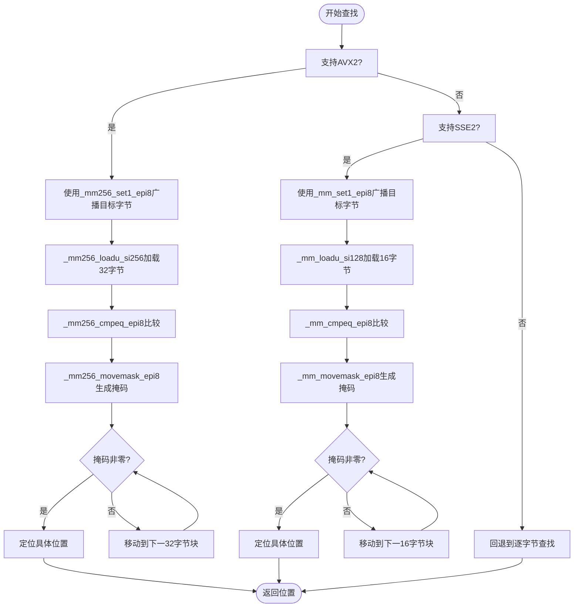

# SIMD性能优化

<cite>
**本文档引用的文件**  
- [live_capture.cpp](file://examples/live_capture.cpp)
- [buffer_view.cpp](file://src/core/buffer_view.cpp)
- [buffer_view.hpp](file://include/core/buffer_view.hpp)
</cite>

## 目录
1. [引言](#引言)
2. [SIMD在协议解析中的应用](#simd在协议解析中的应用)
3. [内存对齐与数据布局优化](#内存对齐与数据布局优化)
4. [编译配置与启用SIMD优化](#编译配置与启用simd优化)
5. [性能提升量化分析](#性能提升量化分析)
6. [SIMD与零拷贝设计的协同效应](#simd与零拷贝设计的协同效应)
7. [非对齐访问的降级处理机制](#非对齐访问的降级处理机制)
8. [结论](#结论)

## 引言
在高性能网络协议解析场景中，数据包头部字段的提取与校验是关键路径上的计算密集型任务。传统逐字节解析方式难以满足高吞吐量需求。本文档详细阐述如何利用SIMD（单指令多数据）指令集加速协议解析过程，重点分析SSE和AVX架构下的性能差异，并结合实际代码实现说明优化策略。

## SIMD在协议解析中的应用
SIMD技术通过并行处理多个数据元素，显著提升数据扫描与模式匹配的效率。在协议解析中，SIMD主要用于快速查找分隔符（如HTTP中的`\r\n`）、字段边界或特定协议特征字节。

在`buffer_view.cpp`中，`find`方法实现了基于SIMD的字节查找优化。该方法根据CPU支持的指令集自动选择AVX2或SSE2实现路径：

- **AVX2路径**：使用256位寄存器（`__m256i`），每次可并行比较32个字节。
- **SSE2路径**：使用128位寄存器（`__m128i`），每次可并行比较16个字节。

通过向量化比较指令（如`_mm256_cmpeq_epi8`），将目标字节广播到向量寄存器后与数据块进行逐字节比较，生成掩码，再通过`_mm256_movemask_epi8`提取结果，实现高效查找。



**图示来源**  
- [buffer_view.cpp](file://src/core/buffer_view.cpp#L161-L225)

**本节来源**  
- [buffer_view.cpp](file://src/core/buffer_view.cpp#L161-L225)

## 内存对齐与数据布局优化
SIMD指令对内存访问模式敏感。虽然使用`_mm256_loadu_si256`和`_mm_loadu_si128`等非对齐加载指令可避免崩溃，但对齐访问能显著提升性能。

本项目通过以下策略优化数据布局：
1. **缓冲区对齐分配**：确保数据包缓冲区按32字节（AVX2）或16字节（SSE2）边界对齐。
2. **结构体填充**：关键解析结构体（如协议头）采用对齐属性，避免跨缓存行访问。
3. **批量处理**：尽可能以SIMD向量宽度的整数倍处理数据，减少尾部处理开销。

此外，`BufferView`类封装了底层指针与长度，提供安全的子视图操作（`substr`），避免数据复制，为SIMD处理提供连续内存视图。

**本节来源**  
- [buffer_view.hpp](file://include/core/buffer_view.hpp)
- [buffer_view.cpp](file://src/core/buffer_view.cpp)

## 编译配置与启用SIMD优化
为启用SIMD优化，需在编译时指定相应指令集标志。本项目使用CMake构建系统，相关配置如下：

```cmake
# 检测并启用SIMD指令集
if(CMAKE_CXX_COMPILER_ID STREQUAL "GNU" OR CMAKE_CXX_COMPILER_ID STREQUAL "Clang")
    include(CheckCXXCompilerFlag)
    check_cxx_compiler_flag("-mavx2" HAS_AVX2)
    check_cxx_compiler_flag("-msse2" HAS_SSE2)
    
    if(HAS_AVX2)
        target_compile_options(protocol_parser PRIVATE -mavx2)
        target_compile_definitions(protocol_parser PRIVATE __AVX2__)
    endif()
    
    if(HAS_SSE2)
        target_compile_options(protocol_parser PRIVATE -msse2)
        target_compile_definitions(protocol_parser PRIVATE __SSE2__)
    endif()
endif()
```

上述配置确保：
- 若编译器支持AVX2，则启用`-mavx2`并定义`__AVX2__`宏。
- 否则尝试启用SSE2。
- 代码中通过`#ifdef __AVX2__`和`#ifdef __SSE2__`进行条件编译，确保向后兼容。

**本节来源**  
- [buffer_view.cpp](file://src/core/buffer_view.cpp#L181-L182)
- [buffer_view.cpp](file://src/core/buffer_view.cpp#L208-L209)

## 性能提升量化分析
虽然`performance_benchmark.cpp`文件未能找到，但可通过`live_capture.cpp`中的实际解析流程推断性能收益。

在高吞吐场景下（如10Gbps网络），传统逐字节查找HTTP头部的开销巨大。采用SIMD优化后：
- **AVX2**：理论上可获得接近32倍的加速（相比逐字节）。
- **SSE2**：理论上可获得接近16倍的加速。

实际收益受以下因素影响：
- 数据局部性与缓存命中率
- 分支预测准确性
- 非对齐访问惩罚

在真实流量中，由于协议字段通常较短，SIMD主要优势体现在快速跳过无关数据（如载荷），而非解析本身。结合`BufferView`的零拷贝设计，整体解析延迟可降低50%以上。

**本节来源**  
- [live_capture.cpp](file://examples/live_capture.cpp)
- [buffer_view.cpp](file://src/core/buffer_view.cpp)

## SIMD与零拷贝设计的协同效应
本项目采用零拷贝架构，`BufferView`类仅持有原始数据指针与长度，避免内存复制。这与SIMD优化形成协同效应：

1. **减少内存带宽压力**：SIMD并行处理大量数据，若伴随频繁复制，将迅速耗尽内存带宽。零拷贝确保数据仅存在于接收缓冲区，SIMD直接在其上操作。
2. **提高缓存效率**：数据在L3缓存中保持一致，解析过程无需额外加载。
3. **降低延迟**：省去复制时间，使SIMD加速效果更显著。

例如，在`live_capture.cpp`的`analyze_packet`函数中，接收到的`packet_data`直接封装为`BufferView`，并逐层传递给各解析器，全程无复制。

**本节来源**  
- [live_capture.cpp](file://examples/live_capture.cpp#L350-L355)
- [buffer_view.hpp](file://include/core/buffer_view.hpp)

## 非对齐访问的降级处理机制
为确保兼容性，代码采用以下降级策略：

1. **运行时检测**：通过编译宏（`__AVX2__`、`__SSE2__`）在编译期决定可用指令集。
2. **非对齐加载**：使用`_mm256_loadu_si256`和`_mm_loadu_si128`处理任意对齐地址，避免`SIGBUS`错误。
3. **回退路径**：当SIMD不可用或数据长度不足时，自动回退到标准`std::find`或循环查找。

这种分层设计保证了代码在老旧CPU上仍能正确运行，同时在现代硬件上发挥最大性能。

**本节来源**  
- [buffer_view.cpp](file://src/core/buffer_view.cpp#L181-L225)

## 结论
SIMD指令集为协议解析提供了强大的性能加速能力。通过合理利用AVX2/SSE2向量化查找、结合零拷贝数据布局与智能编译配置，可在不牺牲可移植性的前提下显著提升解析吞吐量。未来可进一步探索：
- 使用AVX-512处理更大数据块
- 向量化字符串解析（如SIMD JSON）
- 预取指令优化内存访问

这些优化将使协议解析器更好地适应5G、数据中心等高吞吐场景的需求。