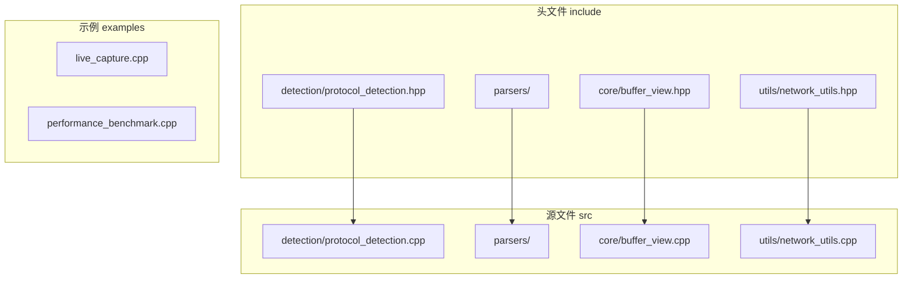
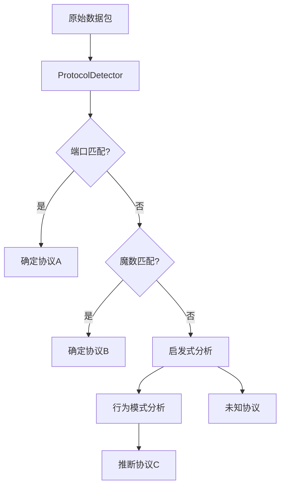
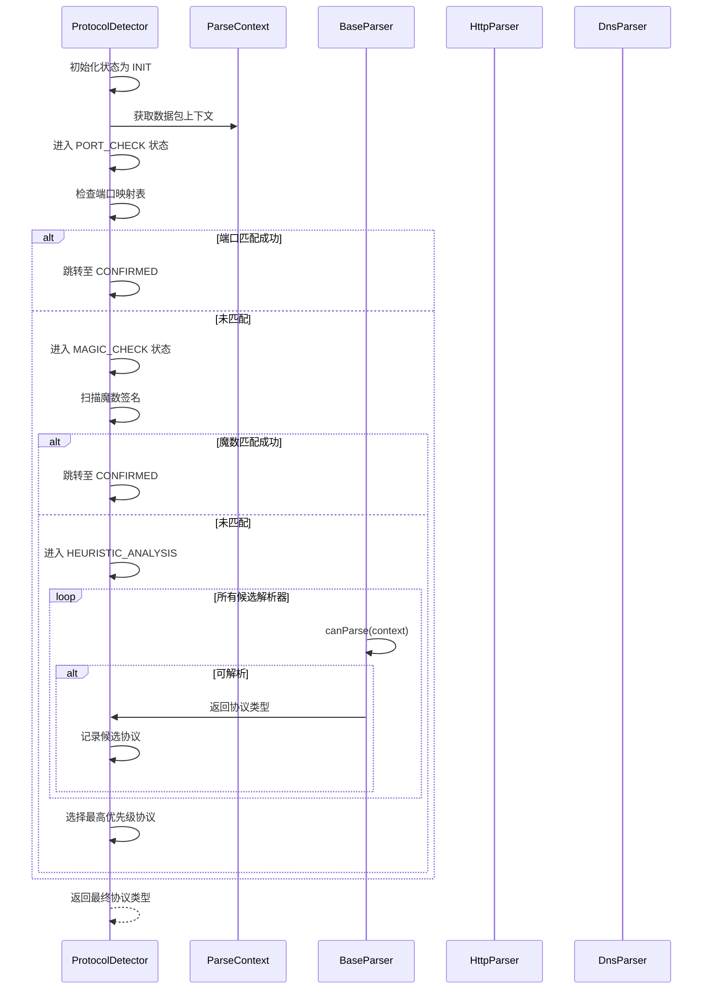
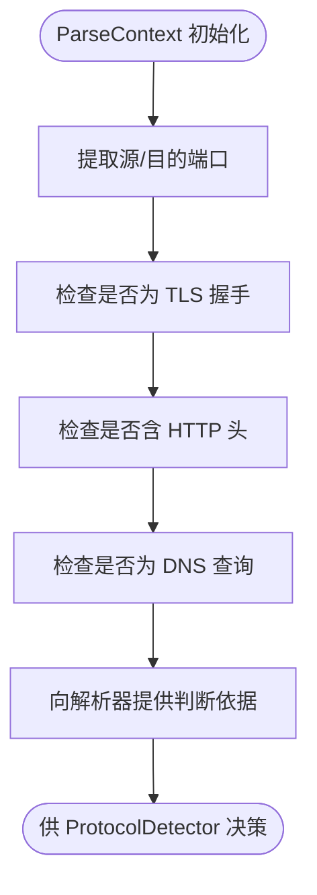
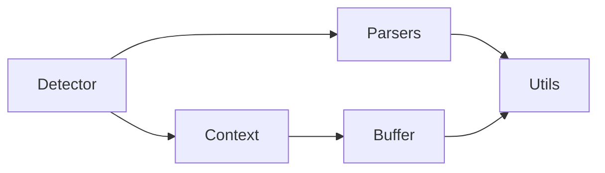

# 智能协议识别

<cite>
**本文档引用文件**  
- [protocol_detection.hpp](file://include/detection/protocol_detection.hpp)
- [protocol_detection.cpp](file://src/detection/protocol_detection.cpp)
- [base_parser.hpp](file://include/parsers/base_parser.hpp)
- [http_parser.hpp](file://include/parsers/application/http_parser.hpp)
- [dns_parser.hpp](file://include/parsers/application/dns_parser.hpp)
- [tcp_parser.hpp](file://include/parsers/transport/tcp_parser.hpp)
- [udp_parser.hpp](file://include/parsers/transport/udp_parser.hpp)
- [buffer_view.hpp](file://include/core/buffer_view.hpp)
- [network_utils.hpp](file://include/utils/network_utils.hpp)
</cite>

## 目录
1. [引言](#引言)
2. [项目结构](#项目结构)
3. [核心组件](#核心组件)
4. [架构概述](#架构概述)
5. [详细组件分析](#详细组件分析)
6. [依赖分析](#依赖分析)
7. [性能考量](#性能考量)
8. [故障排查指南](#故障排查指南)
9. [结论](#结论)

## 引言
本文档深入解析智能协议识别引擎的实现机制，重点阐述如何通过魔数匹配、端口映射和启发式分析相结合的方式，实现对未知网络协议的精准识别。文档详细说明`ProtocolDetector`类的接口设计、状态机转换逻辑以及协议识别优先级策略，揭示`ParseContext`在协议推断过程中的核心作用。同时提供自定义识别规则的扩展方法，列举常见误识别场景及其解决方案，并分析识别准确率与性能开销之间的权衡。

## 项目结构
项目采用分层模块化设计，主要分为`include`（头文件）、`src`（源文件）和`examples`（示例）三大目录。核心功能按功能划分在不同子目录中，如`detection`负责协议检测，`parsers`包含各类协议解析器，`core`提供基础数据结构支持。



**图示来源**  
- [protocol_detection.hpp](file://include/detection/protocol_detection.hpp)
- [protocol_detection.cpp](file://src/detection/protocol_detection.cpp)
- [buffer_view.hpp](file://include/core/buffer_view.hpp)

**本节来源**  
- [protocol_detection.hpp](file://include/detection/protocol_detection.hpp)
- [CMakeLists.txt](file://CMakeLists.txt)

## 核心组件
智能协议识别的核心在于`ProtocolDetector`类，该类封装了协议识别的完整流程。其设计采用策略模式，结合静态规则（端口映射、魔数）与动态分析（启发式行为）进行综合判断。`ParseContext`作为上下文对象，贯穿整个识别过程，用于传递数据包内容、当前解析状态及中间推断结果。

**本节来源**  
- [protocol_detection.hpp](file://include/detection/protocol_detection.hpp#L15-L80)
- [base_parser.hpp](file://include/parsers/base_parser.hpp#L10-L40)

## 架构概述
系统采用分层识别架构，首先通过快速匹配（端口、魔数）进行初步筛选，若无法确定则进入深度启发式分析阶段。各协议解析器继承自`BaseParser`，实现统一接口，便于扩展和管理。



**图示来源**  
- [protocol_detection.hpp](file://include/detection/protocol_detection.hpp#L20-L60)
- [base_parser.hpp](file://include/parsers/base_parser.hpp#L5-L15)

## 详细组件分析

### ProtocolDetector 类分析
`ProtocolDetector`是协议识别的主控类，其状态机包含`INIT`, `PORT_CHECK`, `MAGIC_CHECK`, `HEURISTIC_ANALYSIS`, `CONFIRMED`, `UNKNOWN`等状态。状态转换由输入数据特征驱动，优先级策略确保已知协议优先识别，避免误判。

#### 类图
```mermaid
classDiagram
class ProtocolDetector {
+enum State { INIT, PORT_CHECK, MAGIC_CHECK, HEURISTIC, CONFIRMED, UNKNOWN }
+std : : map<int, Protocol> portMap
+std : : vector<Signature> magicNumbers
+ParseContext& context
+detect() Protocol
-checkPort() bool
-checkMagic() bool
-runHeuristics() Protocol
-updateState(newState) void
}
class ParseContext {
+const BufferView& rawData
+Protocol inferredProtocol
+int srcPort
+int dstPort
+bool isTlsHandshake()
+bool containsHttpHeaders()
}
class BaseParser {
+virtual bool canParse(ParseContext&) = 0
+virtual void parse(ParseContext&) = 0
}
ProtocolDetector --> ParseContext : "使用"
ProtocolDetector --> BaseParser : "协调"
BaseParser <|-- HttpParser : "实现"
BaseParser <|-- DnsParser : "实现"
```

**图示来源**  
- [protocol_detection.hpp](file://include/detection/protocol_detection.hpp#L10-L50)
- [base_parser.hpp](file://include/parsers/base_parser.hpp#L5-L20)
- [http_parser.hpp](file://include/parsers/application/http_parser.hpp#L5-L15)

#### 识别流程序列图


**图示来源**  
- [protocol_detection.cpp](file://src/detection/protocol_detection.cpp#L30-L120)
- [http_parser.cpp](file://src/parsers/application/http_parser.cpp#L15-L40)
- [dns_parser.cpp](file://src/parsers/application/dns_parser.cpp#L15-L35)

### ParseContext 作用分析
`ParseContext`是协议推断过程中的核心数据载体，封装了原始数据视图、端口信息及辅助判断方法。其设计避免了数据重复拷贝，通过`BufferView`实现零拷贝访问，提升性能。



**图示来源**  
- [parse_context.hpp](file://include/detection/parse_context.hpp#L10-L50)
- [buffer_view.hpp](file://include/core/buffer_view.hpp#L5-L25)

**本节来源**  
- [protocol_detection.hpp](file://include/detection/protocol_detection.hpp#L1-L100)
- [parse_context.hpp](file://include/detection/parse_context.hpp#L1-L60)
- [buffer_view.hpp](file://include/core/buffer_view.hpp#L1-L30)

## 依赖分析
系统依赖关系清晰，`ProtocolDetector`依赖`ParseContext`和各类`Parser`，各`Parser`依赖`network_utils`进行字段解析。无循环依赖，模块耦合度低。



**图示来源**  
- [protocol_detection.hpp](file://include/detection/protocol_detection.hpp)
- [base_parser.hpp](file://include/parsers/base_parser.hpp)
- [network_utils.hpp](file://include/utils/network_utils.hpp)

**本节来源**  
- [protocol_detection.hpp](file://include/detection/protocol_detection.hpp#L1-L20)
- [base_parser.hpp](file://include/parsers/base_parser.hpp#L1-L10)
- [network_utils.hpp](file://include/utils/network_utils.hpp#L1-L15)

## 性能考量
协议识别在准确率与性能间需权衡。魔数和端口匹配为O(1)操作，效率高；启发式分析涉及多轮模式匹配，开销较大。建议在高吞吐场景下关闭深度启发式分析，或通过采样方式运行。

**本节来源**  
- [performance_monitor.hpp](file://include/monitoring/performance_monitor.hpp#L5-L25)
- [protocol_detection.cpp](file://src/detection/protocol_detection.cpp#L100-L150)

## 故障排查指南
常见误识别场景包括：加密流量伪装为普通协议、非标准端口服务、协议隧道嵌套等。解决方案包括更新魔数库、配置白名单规则、启用上下文感知分析等。

**本节来源**  
- [SOTA_IMPLEMENTATION_REPORT.md](file://SOTA_IMPLEMENTATION_REPORT.md#L50-L80)
- [org_design_doc.md](file://org_design_doc.md#L100-L130)

## 结论
智能协议识别引擎通过多维度分析策略实现了高精度识别。其模块化设计便于扩展，`ParseContext`机制有效支持复杂推断逻辑。未来可引入机器学习模型进一步提升未知协议识别能力。