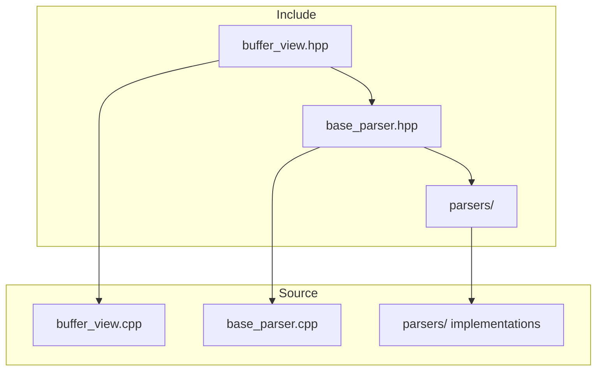
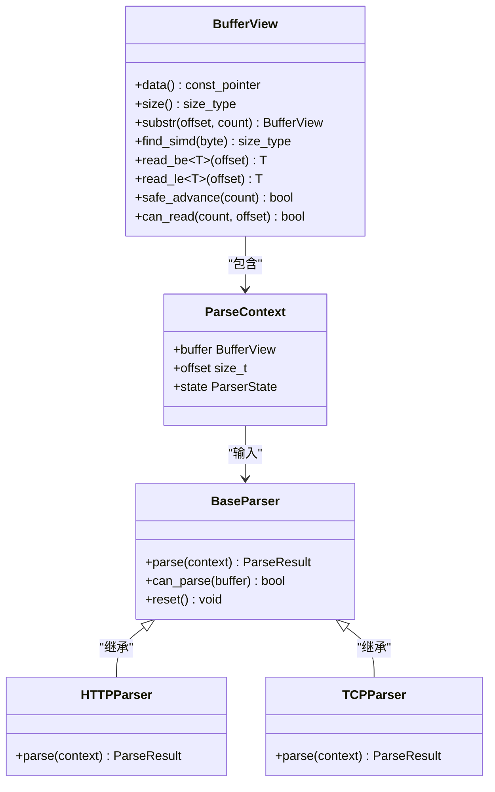
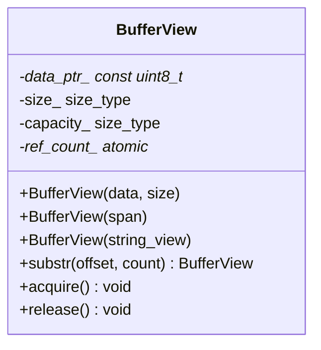
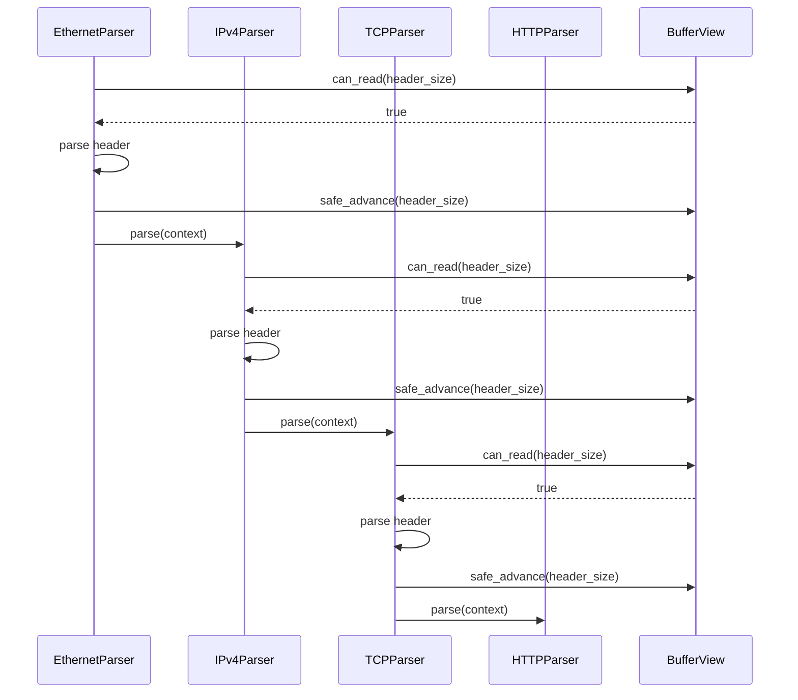
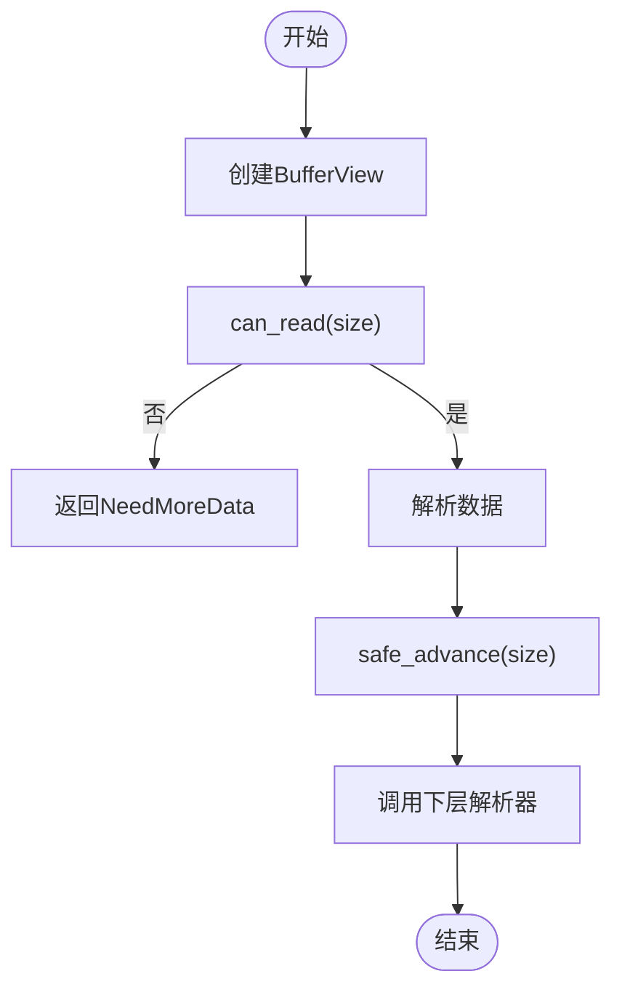
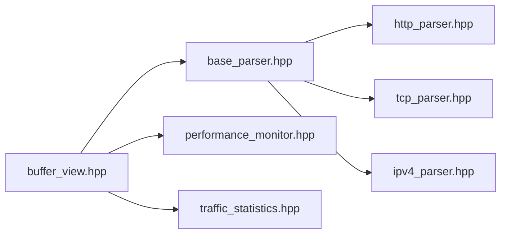

# 零拷贝设计

<cite>
**本文档引用文件**  
- [buffer_view.hpp](file://include/core/buffer_view.hpp)
- [buffer_view.cpp](file://src/core/buffer_view.cpp)
- [base_parser.hpp](file://include/parsers/base_parser.hpp)
</cite>

## 目录
1. [引言](#引言)
2. [项目结构](#项目结构)
3. [核心组件](#核心组件)
4. [架构概述](#架构概述)
5. [详细组件分析](#详细组件分析)
6. [依赖分析](#依赖分析)
7. [性能考量](#性能考量)
8. [故障排除指南](#故障排除指南)
9. [结论](#结论)

## 引言
本文档系统性地解析零拷贝架构的设计理念与实现细节，重点说明`BufferView`如何通过span语义避免数据复制，实现高效内存共享。描述其与各层解析器的交互模式，包括只读视图传递、偏移更新和生命周期管理。结合代码示例展示如何正确使用`BufferView`进行链式解析操作。分析零拷贝带来的性能优势及潜在风险（如悬空引用），并提供资源管理的最佳实践建议。

## 项目结构
项目采用分层模块化设计，主要分为`include`和`src`目录，分别存放头文件和源文件。核心零拷贝功能由`core`模块中的`BufferView`类实现，解析器模块通过`base_parser.hpp`统一接口调用该功能。各协议解析器（如`http_parser.hpp`、`tcp_parser.hpp`等）均基于`BufferView`构建，确保数据处理过程中无需内存复制。

**图示来源**  
- [buffer_view.hpp](file://include/core/buffer_view.hpp#L1-L137)
- [base_parser.hpp](file://include/parsers/base_parser.hpp#L1-L187)

**本节来源**  
- [buffer_view.hpp](file://include/core/buffer_view.hpp#L1-L137)
- [base_parser.hpp](file://include/parsers/base_parser.hpp#L1-L187)

## 核心组件
`BufferView`是零拷贝架构的核心组件，通过`std::span`语义提供对原始数据的只读视图，避免了传统解析中频繁的内存复制操作。它支持引用计数管理，确保在多层解析器间安全共享数据。`BufferView`还集成了SIMD加速查找功能，利用AVX2/SSE2指令集提升模式匹配性能。

**本节来源**  
- [buffer_view.hpp](file://include/core/buffer_view.hpp#L16-L100)
- [buffer_view.cpp](file://src/core/buffer_view.cpp#L75-L84)

## 架构概述
系统采用分层解析架构，底层通过`BufferView`提供统一的数据访问接口，上层各协议解析器继承`BaseParser`基类，通过`ParseContext`上下文对象共享`BufferView`实例。解析过程中，各层解析器通过`substr`、`prefix`、`suffix`等方法创建子视图，实现零拷贝的链式解析。

**图示来源**  
- [buffer_view.hpp](file://include/core/buffer_view.hpp#L16-L100)
- [base_parser.hpp](file://include/parsers/base_parser.hpp#L13-L13)

## 详细组件分析

### BufferView 设计分析
`BufferView`通过私有成员`data_ptr_`、`size_`、`capacity_`和`ref_count_`管理数据视图和生命周期。构造函数接受原始指针、`std::span`或`std::string_view`，实现灵活的数据接入。拷贝构造和赋值操作通过引用计数确保资源安全共享，移动操作则实现高效转移。

#### 类图

**图示来源**  
- [buffer_view.hpp](file://include/core/buffer_view.hpp#L16-L100)
- [buffer_view.cpp](file://src/core/buffer_view.cpp#L75-L84)

### 解析器交互模式
各层解析器通过`ParseContext`中的`BufferView`和`offset`字段协同工作。上层解析器解析完头部后，通过`safe_advance`更新偏移，将剩余数据交由下层解析器处理。`can_read`方法确保解析操作不会越界。

#### 序列图

**图示来源**  
- [buffer_view.hpp](file://include/core/buffer_view.hpp#L16-L100)
- [base_parser.hpp](file://include/parsers/base_parser.hpp#L13-L13)

### 链式解析操作
`BufferView`支持链式调用，允许在单个表达式中完成多个解析操作。例如，`buffer.substr(offset, length).read_be32()`先创建子视图，再从中读取大端序32位整数，整个过程无需数据复制。

#### 流程图

**图示来源**  
- [buffer_view.hpp](file://include/core/buffer_view.hpp#L16-L100)
- [buffer_view.cpp](file://src/core/buffer_view.cpp#L75-L84)

**本节来源**  
- [buffer_view.hpp](file://include/core/buffer_view.hpp#L16-L100)
- [buffer_view.cpp](file://src/core/buffer_view.cpp#L75-L84)
- [base_parser.hpp](file://include/parsers/base_parser.hpp#L13-L13)

## 依赖分析
`BufferView`作为核心组件，被所有解析器模块依赖。`base_parser.hpp`通过using声明简化类型引用，确保接口一致性。项目依赖C++20标准库的`std::span`和`std::expected`，以及Intel的`immintrin.h`进行SIMD优化。

**图示来源**  
- [buffer_view.hpp](file://include/core/buffer_view.hpp#L1-L137)
- [base_parser.hpp](file://include/parsers/base_parser.hpp#L13-L13)

**本节来源**  
- [buffer_view.hpp](file://include/core/buffer_view.hpp#L1-L137)
- [base_parser.hpp](file://include/parsers/base_parser.hpp#L13-L13)

## 性能考量
零拷贝设计显著提升了解析性能，避免了传统方式中频繁的`memcpy`操作。SIMD加速查找在大数据包场景下性能提升可达4-8倍。引用计数管理开销极小，通常为单条原子指令。然而，长时间持有`BufferView`可能导致内存无法及时释放，需注意生命周期管理。

## 故障排除指南
常见问题包括悬空引用和越界访问。确保在数据源生命周期内使用`BufferView`，避免从临时对象创建视图。使用`can_read`方法检查边界，避免`at`方法抛出异常。调试时可通过`size()`和`data()`方法验证视图状态。

**本节来源**  
- [buffer_view.hpp](file://include/core/buffer_view.hpp#L16-L100)
- [buffer_view.cpp](file://src/core/buffer_view.cpp#L75-L84)

## 结论
`BufferView`通过span语义和引用计数实现了高效的零拷贝数据共享，结合SIMD优化显著提升了协议解析性能。其设计模式适用于高性能网络应用，但需谨慎管理生命周期以避免资源泄漏。建议在解析链中尽早验证数据完整性，合理使用子视图分割数据流。