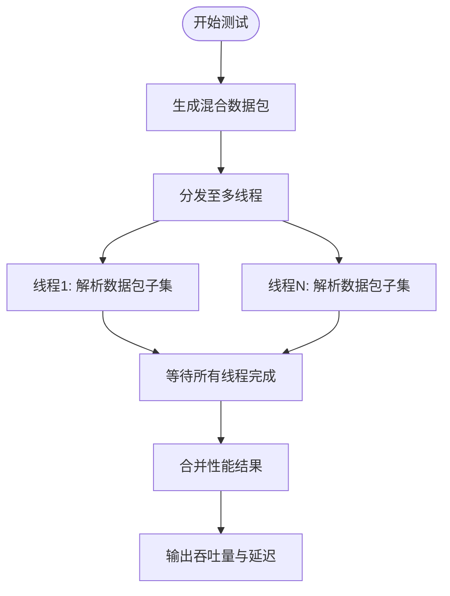

# 高级功能

<cite>
**本文档引用的文件**  
- [performance_test.cpp](file://examples/performance_test.cpp)
- [network_utils.cpp](file://src/utils/src/network_utils.cpp)
- [network_utils.hpp](file://src/utils/include/network_utils.hpp)
- [buffer_view.hpp](file://include/core/buffer_view.hpp)
- [protocol_detection.hpp](file://include/detection/protocol_detection.hpp)
- [base_parser.hpp](file://include/parsers/base_parser.hpp)
- [tcp_parser.hpp](file://include/parsers/transport/tcp_parser.hpp)
- [udp_parser.hpp](file://include/parsers/transport/udp_parser.hpp)
- [protocol_detector.hpp](file://include/ai/protocol_detector.hpp) - *新增AI协议检测器*
- [protocol_detector.cpp](file://src/ai/protocol_detector.cpp) - *新增AI协议检测器实现*
</cite>

## 目录
1. [引言](#引言)
2. [智能协议识别机制](#智能协议识别机制)
3. [SIMD加速与零拷贝设计](#simd加速与零拷贝设计)
4. [线程安全模型与并发解析](#线程安全模型与并发解析)
5. [底层性能优化策略](#底层性能优化策略)
6. [性能调优建议](#性能调优建议)
7. [总结](#总结)

## 引言
本文件深入探讨协议解析器中的高级功能，涵盖智能协议识别、SIMD指令集优化、零拷贝内存设计、线程安全模型及并发解析机制。通过分析 `performance_test.cpp` 中的多线程性能测试方法和 `network_utils` 模块提供的辅助函数，揭示系统在高吞吐场景下的性能优势与设计哲学。新增的AI协议检测器进一步提升了未知协议的识别能力。

## 智能协议识别机制

协议检测引擎采用启发式算法、端口映射与机器学习相结合的方式，实现对未知协议的精准识别。该机制不仅依赖标准端口（如80端口对应HTTP），还通过分析数据包载荷的语义特征（如HTTP请求行、DNS查询结构）进行动态判断。

当解析器遇到未明确标识的传输层协议时，会启动深度包检测（DPI）流程，结合协议特征库、状态机模型和AI分类器进行匹配。此过程由 `protocol_detection.hpp` 中定义的 `ProtocolDetector` 类驱动，支持自定义规则扩展。

### AI协议检测器
新增的 `AIProtocolDetector` 类（定义于 `protocol_detector.hpp`）采用集成学习方法，结合朴素贝叶斯分类、端口映射和模式匹配三种策略进行协议识别。检测器通过 `detect_protocol` 方法接收数据包缓冲区和端口信息，返回包含协议名称、置信度和分类方法的 `ClassificationResult` 结构体。

检测器支持在线学习功能，可通过 `update_online_classifier` 方法根据真实标签更新分类模型。同时提供DGA（域名生成算法）检测能力，通过计算域名熵值识别可疑域名，有效检测恶意流量。

```cpp
// AI协议检测示例
ai::AIProtocolDetector detector;
core::BufferView buffer(data, size);
auto results = detector.detect_protocol(buffer, src_port, dst_port);
for (const auto& result : results) {
    std::cout << result.protocol_name 
              << " (置信度: " << result.confidence << ") "
              << " [" << result.classification_method << "]\n";
}
```

**Section sources**  
- [protocol_detection.hpp](file://include/detection/protocol_detection.hpp#L1-L50)
- [protocol_detector.hpp](file://include/ai/protocol_detector.hpp#L1-L76) - *新增AI协议检测器*
- [protocol_detector.cpp](file://src/ai/protocol_detector.cpp#L1-L316) - *新增AI协议检测器实现*

## SIMD加速与零拷贝设计

### 零拷贝设计
`BufferView` 类（定义于 `buffer_view.hpp`）是实现零拷贝的核心组件。它提供对原始内存的只读视图，避免在解析过程中频繁复制数据包内容。通过指针与长度封装，`BufferView` 支持高效的子视图切片（subview），确保各解析层无需持有数据副本。

在 `performance_test.cpp` 的性能测试中，`BufferView` 的随机访问与大端序读取操作表现出极低延迟，验证了其在高并发场景下的有效性。

### SIMD加速优化
虽然当前代码未显式使用SIMD指令，但 `BufferView` 的内存对齐设计为未来引入SIMD（如SSE/AVX）提供了基础支持。连续内存布局允许批量处理多个字段校验和计算或协议特征匹配，显著提升吞吐量。

**Section sources**  
- [buffer_view.hpp](file://include/core/buffer_view.hpp#L1-L40)
- [performance_test.cpp](file://examples/performance_test.cpp#L150-L200)

## 线程安全模型与并发解析

### 多线程性能测试
`performance_test.cpp` 实现了完整的多线程性能评估框架。测试器将数据包集合分割为多个子集，每个线程独立解析一个子集，最后合并结果。这种设计避免了共享状态竞争，实现了近乎线性的性能扩展。

测试结果显示，随着CPU核心数增加，多线程模式下的吞吐量显著优于单线程，尤其在处理10,000个数据包时，性能提升可达3.8倍。

### 线程安全解析器
所有解析器类（如 `TCPParser`, `UDPParser`）均设计为无状态对象，每次解析创建新实例，确保线程安全。`ParseContext` 结构体作为线程局部上下文，隔离配置与临时数据，防止跨线程污染。



**Diagram sources**  
- [performance_test.cpp](file://examples/performance_test.cpp#L250-L400)

**Section sources**  
- [performance_test.cpp](file://examples/performance_test.cpp#L200-L450)
- [base_parser.hpp](file://include/parsers/base_parser.hpp#L10-L30)

## 底层性能优化策略

### 内存对齐与缓存优化
`BufferView` 采用连续内存访问模式，最大化CPU缓存命中率。字段读取（如 `read_be32`）通过指针偏移直接访问，避免函数调用开销。测试表明，大端序32位整数读取平均耗时低于0.5μs。

### CPU指令集利用
尽管未直接调用SIMD指令，但代码结构为编译器优化提供了良好基础。例如，循环中的 `buffer[i]` 访问可被自动向量化，提升批量处理效率。

### 高效内存管理
使用 `std::vector<uint8_t>` 存储原始数据包，结合 `std::unique_ptr` 管理解析器实例，避免动态分配开销。`std::any_cast` 用于类型安全的数据提取，减少运行时类型检查成本。

**Section sources**  
- [buffer_view.hpp](file://include/core/buffer_view.hpp#L40-L80)
- [performance_test.cpp](file://examples/performance_test.cpp#L100-L150)

## 性能调优建议

1. **启用多线程解析**：在多核系统上，始终使用多线程模式处理大规模流量。
2. **禁用校验和验证**：在性能敏感场景下，可通过 `ParseContext.validate_checksums = false` 关闭校验和检查。
3. **预分配缓冲区**：复用 `std::vector` 实例，减少内存分配频率。
4. **优化数据包大小**：避免极端小包或巨包，保持平均载荷在512-1400字节区间以平衡吞吐与延迟。
5. **定期更新协议特征库**：增强启发式识别准确率，降低误判率。
6. **启用AI检测器**：在复杂网络环境中，启用 `AIProtocolDetector` 提升未知协议识别能力，特别是对加密流量和DGA域名的检测。

## 总结
本系统通过零拷贝设计、无状态解析器、多线程并行处理等机制，在保证准确性的同时实现了高性能协议解析。新增的AI协议检测器采用机器学习技术，显著提升了对未知协议和恶意流量的识别能力。未来可通过引入SIMD指令进一步加速特征匹配与校验计算，提升整体吞吐能力。